Installation
------------

Currently only available via github. Easiest way to install is to use the `devtools` package:

``` r
devtools::install_github("USGS-R/gsplot")
```

This package is still very much in development, so the API may change at any time.

[](https://ci.appveyor.com/project/jread-usgs/gsplot)

[](https://travis-ci.org/USGS-R/gsplot)

[](https://coveralls.io/github/USGS-R/gsplot?branch=master)

Overview
--------

The goal of this package is to simplify plotting in R. This includes improving the basic workflow and using defaults that tend to adhear to USGS style guidelines. Extra features and functions are included that are not available in base for common USGS elements (error bars, callouts, reverse y axes, etc.). This is intended to make the plotting code more concise and easier to interpret for the sake of reproducibility.

<table style="width:57%;">
<colgroup>
<col width="19%" />
<col width="37%" />
</colgroup>
<thead>
<tr class="header">
<th>Feature</th>
<th>Description</th>
</tr>
</thead>
<tbody>
<tr class="odd">
<td><a href="#pipes">Piping and plots as objects</a></td>
<td>Easily add features to your plot.</td>
</tr>
<tr class="even">
<td><a href="#legend">Automatic legend</a></td>
<td>For each plot feature, a corresponding legend name can be specified. Eliminates the need to duplicate <code>par</code> arguments.</td>
</tr>
<tr class="odd">
<td><a href="#limits">Automatic limits</a></td>
<td>Automatically regenerate limits of plot when new features are added.</td>
</tr>
<tr class="even">
<td><a href="#error">Error bars</a></td>
<td>Apply error bars to points by specifying the upper and lower offsets.</td>
</tr>
<tr class="odd">
<td><a href="#callouts">Callouts</a></td>
<td>Add a line and label in one call.</td>
</tr>
<tr class="even">
<td><a href="#reverse">Axes reversal</a></td>
<td>Reverse the axis by specifying one argument to <code>axis()</code>.</td>
</tr>
<tr class="odd">
<td><a href="#embed">Embedded functions</a></td>
<td>Add extra plot features within a points call (no duplication of x/y values)</td>
</tr>
<tr class="even">
<td><a href="#where">Change rendering order</a></td>
<td>Manipulate what order plot features are rendered by specifying the argument <code>where</code></td>
</tr>
<tr class="odd">
<td><a href="#base">Compatibility with base</a></td>
<td>Can start a plot using <code>gsplot</code>, and add base R features afterwards.</td>
</tr>
</tbody>
</table>

<a name="pipes"></a>

#### Piping and plot objects

With the magrittr pipe (`%>%`) and the gsplot object, you can easily add features to your plot without needing repeat code.

``` r
# base:
plot(1:3, 2:4)
lines(1:5, 5:1)

# add blue points after the initial plot
plot(1:3, 2:4)
lines(1:5, 5:1)
points(4,3, col="blue")
```

``` r
myplot <- gsplot() %>% 
  points(1:3, 2:4) %>%
  lines(1:5, 5:1)

# add blue points after the initial plot
myplot <- myplot %>% points(4,3,col="blue")
myplot
```


<a name="legend"></a>

#### Automatic legend

For each plot feature, the argument `legend.name` can be included in it's function call. Then, the `legend()` function is used to add the legend to your plot object. This creates a legend that inherits `par` specifications from the function calls, so that you do not have to also include it in the legend call.

``` r
# base:
plot(1:3, 1:3, col = "green", pch = 8) 
points(1:3, 3:1, col = "red", pch = 20)
lines(1:3, 1:3, lty = 2) 
rect(1.15,2,1.25,2.5, col = "blue", density = 15, angle = 45)
legend(x = "topright", legend = c("my points", "some other points", "some line", "box"),
       col = c("green", "red", "black", "blue"), 
       pch = c(8,20,NA,NA), 
       lty = c(NA,NA,2,NA), 
       density = c(NA,NA,NA,15), 
       angle = c(NA,NA,NA,45), 
       fill = c("white","white","white","blue"), 
       border = c(NA,NA,NA,"black"))
```

``` r
myplot <- gsplot() %>% 
  points(1:3, 1:3, col = "green", pch = 8, legend.name = "my points") %>% 
  points(1:3, 3:1, col = "red", pch = 20, legend.name = "some other points") %>% 
  lines(1:3, 1:3, lty = 2, legend.name = "some line") %>% 
  rect(1.15,2,1.25,2.5, col = "blue", density = 15, angle = 45, legend.name = "box") %>% 
  legend()
myplot
```

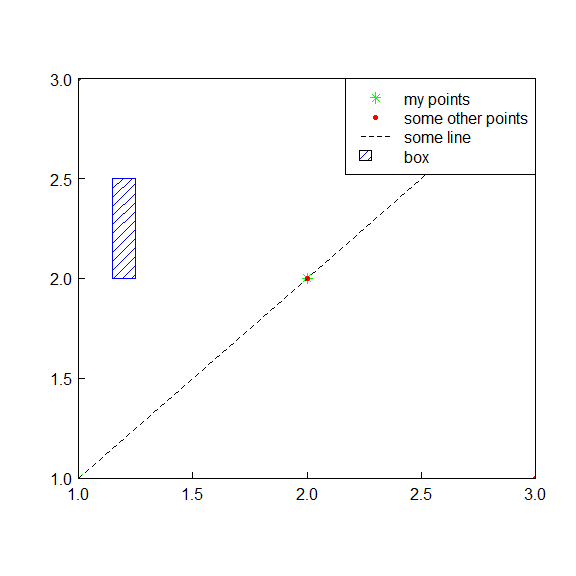

<a name="limits"></a>

#### Automatic limits

`gsplot` automatically regenerates plot limits when new features are added, so that the user does not need to explicity do so.

``` r
# base:
plot(1:3,1:3)
points(5:6,5:6)

#cuts it off, so you need to re-plot with different limits
plot(1:3,1:3, ylim = c(1,6), xlim = c(1,6))
points(5:6,5:6)
```

``` r
limitsplot <- gsplot() %>% 
  points(1:3,1:3) %>% 
  points(5:6,5:6)
limitsplot
```

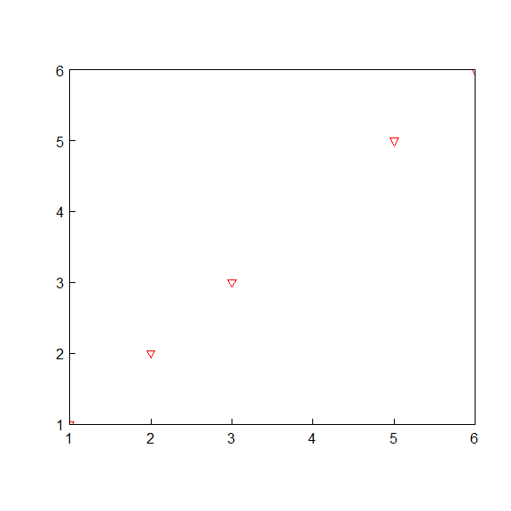

<a name="error"></a>

#### Error bars

Apply error bars to points by specifying the upper and lower offsets. Horizontal and vertical error bars can be completed in the same call to `error_bar`. Error bar values are incorporated into the automatic limit calculations.

``` r
# base:
plot(1:7, 1:7, ylim=c(0, 8)) 
arrows(x0 = 1:7, x1 = 1:7, 
       y0 = 1:7, y1 = 2:8, 
       angle = 90, length = 0.1)
arrows(x0 = 1:7, x1 = 1:7, 
       y0 = 1:7, y1 = 0:6, 
       angle = 90, length = 0.1)
```

``` r
errorbarplot <- gsplot() %>% 
  points(1:7, 1:7) %>% 
  error_bar(x = 1:7, y = 1:7, y.high = 1, y.low = 1)
errorbarplot
```

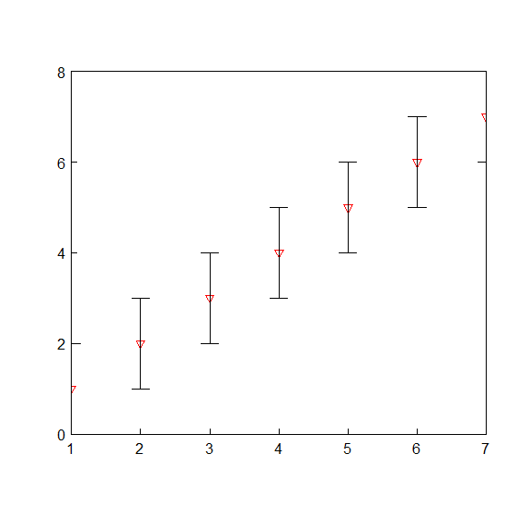

<a name="callouts"></a>

#### Callouts

Add a line and label in one call, rather than making a call to `segments` and `text`. This function automatically determines if the callout line will be outside of the plot limits, and changes the angle accordingly.

``` r
# base:
plot(1:3,1:3)
segments(x0 = 1:2, y0 = 1:2, x1 = c(1.25,2.25), y1 = c(1.25,2.25))
text(x = c(1.25,2.25), y = c(1.25,2.25), 
     labels = paste("point", 1:2), pos = 4)
segments(x0 = 3, y0 = 3, x1 = 2.75, y1 = 2.75)
text(x = 2.75, y = 2.75, labels = paste("point 3"), pos = 2)
```

``` r
calloutsplot <- gsplot() %>% 
  points(1:3,1:3) %>% 
  callouts(1:3, 1:3, labels = paste("point", 1:3))
calloutsplot
```


<a name="reverse"></a>

#### Axis reversal

If the axis needs to be reversed, you can add the argument `reverse = TRUE` to the function call. The order of your data does not need to change, and you can easily revert the axis flip.

``` r
# base:
data_y <- c(1,7,23,47,31)
plot(1:5, rev(data_y)) 
```

``` r
data_y <- c(1,7,23,47,31)
reverseplot <- gsplot() %>% 
  points(1:5, data_y) %>% 
  axis(side = 2, reverse = TRUE)
reverseplot
```

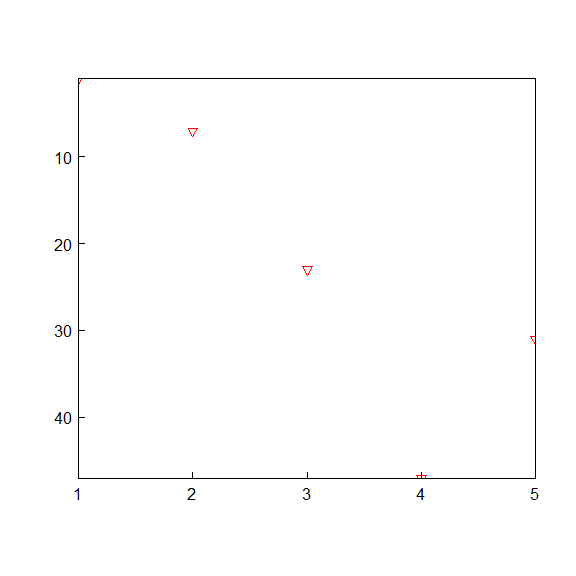

<a name="embed"></a>

#### Embedded functions

Add features that apply to points within the points call, so that it inherits those values. Reduces the amount of code because you are not repeating the points values.

``` r
# base:
plot(1:5, 1:5) 
arrows(x0 = 1:5, x1 = 1:5, 
       y0 = 1:5, y1 = 2:6, 
       angle = 90, length = 0.1)
arrows(x0 = 1:5, x1 = 1:5, 
       y0 = 1:5, y1 = 0.5:4.5, 
       angle = 90, length = 0.1)
segments(x0 = 1:5, y0 = 1:5, x1 = 1.25:5.25, y1 = 1.25:5.25)
text(x = 1.25:5.25, y = 1.25:5.25, 
     labels = paste("pt", 1:5), pos = 4)
```

``` r
embedplot <- gsplot() %>% 
  points(1:5, 1:5, 
         error_bar(y.high = 1, y.low = 0.5),
         callouts(labels = paste("pt", 1:5))) 
embedplot
```

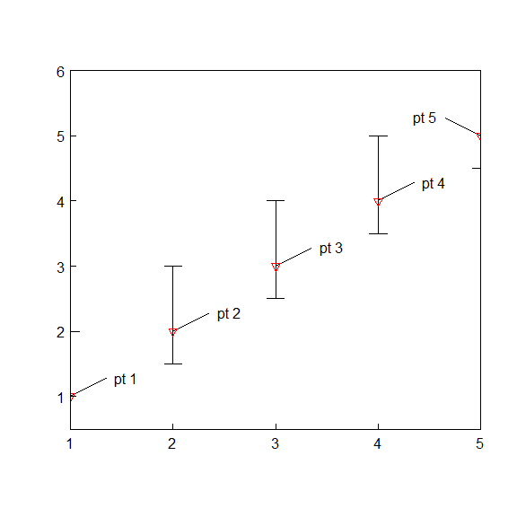

<a name="where"></a>

#### Change rendering order

For each plot feature that is added (`points`, `lines`, `callouts`, etc), you can specify if it should render in it's current position (after everything above it) or whether it should go before everything else. Simply add the argument `where = 'first'` or leave the default `where = "last"`.

``` r
renderorderplot <- gsplot() %>% 
  points(1:5, 1:5, col = "blue", legend.name = "data pts") %>% 
  callouts(2,2, labels = "my note") %>% 
  legend(location = "topleft", legend_offset=0.5)
renderorderplot
```

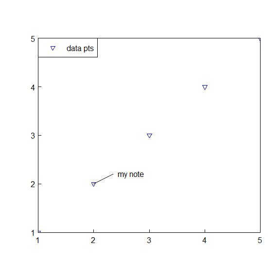

Say we have the plot above, but would like to add two red points.

``` r
renderorderplot_add <- renderorderplot %>% 
  points(c(2.5,3), c(2,3), pch = 18, cex = 3, legend.name = "additional pts") 
renderorderplot_add
```

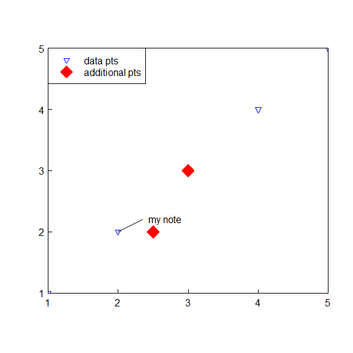

Easy to do with `gsplot`, but now the two red points are covering up features in the original plot. We can easily change this by using the `where` argument when adding to the plot. Specifying `where` will also update the order of the legend.

``` r
renderorderplot_order <- renderorderplot %>% 
  points(c(2.5,3), c(2,3), pch = 18, cex = 3, legend.name = "additional pts", where = "first") 
renderorderplot_order
```

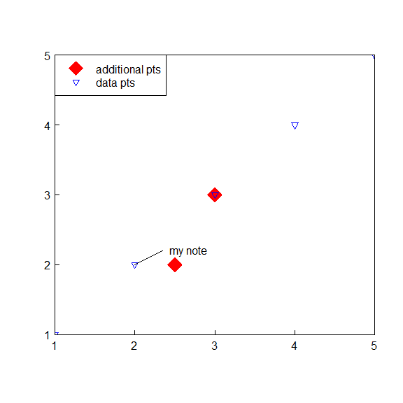

<a name="base"></a>

#### Compatibility with base plotting

If you need to use a feature that `gsplot` has yet to implement, you can always start with `gsplot` and add on using base R. The reverse is (starting with base and then using `gsplot`) is not supported.

``` r
date_vector <- seq(as.Date("2010-10-01"), as.Date("2011-09-30"), by="months")
gs <- gsplot() %>% 
  points(date_vector, 1:12)
gs

points(as.Date("2010-11-15"),2.5)
```

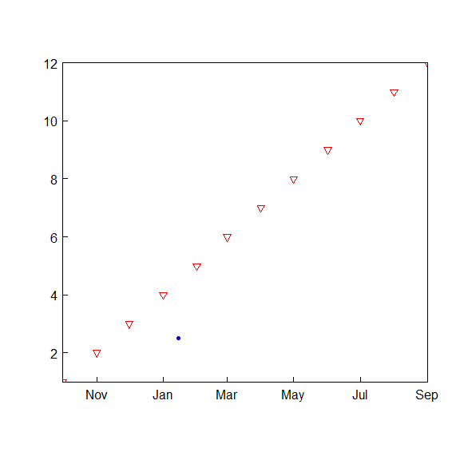

Improved workflow examples
--------------------------

``` r
demoPlot <- gsplot() %>%
  points(y=c(3,1,2), x=1:3, xlim=c(0,NA),ylim=c(0,NA),
         col="blue", pch=18, legend.name="Points", xlab="Index") %>%
  lines(c(3,4,3), c(2,4,6), legend.name="Lines", ylab=expression(paste("Data [ft"^"3","/s]"))) %>%
  abline(b=1, a=0, legend.name="1:1") %>%
  axis(side=c(3,4), labels=FALSE) %>%
  legend(location="topleft",title="Awesome!") %>%
  grid() %>%
  error_bar(x=1:3, y=c(3,1,2), y.high=c(0.5,0.25,1), y.low=0.1) %>%
  error_bar(x=1:3, y=c(3,1,2), x.low=.2, x.high=.2, col="red",lwd=3) %>%
  callouts(x=1, y=2.8, lwd=2, angle=250, labels="Weird data") %>%
  title("Graphing Fun")
demoPlot
```

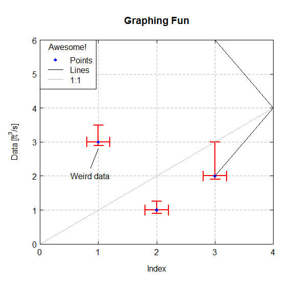

``` r
gs <- gsplot() %>%
  points(y=c(3,1,2,4,5), x=c(1:3,8,80), 
         col="blue", pch=18, legend.name="Points") %>%
  lines(c(3,4,3), c(2,4,6), legend.name="Lines", 
        ylab="logged y axis", xlab="logged x axis", log='xy') %>%
  callouts(x=8, y=4, lwd=2, angle=45, labels="Not sure about this one") %>%
  title("logged axes") %>%
  axis(side=c(3,4), labels=FALSE, n.minor=4) %>%
  axis(side=c(1,2), n.minor=4)
gs
```

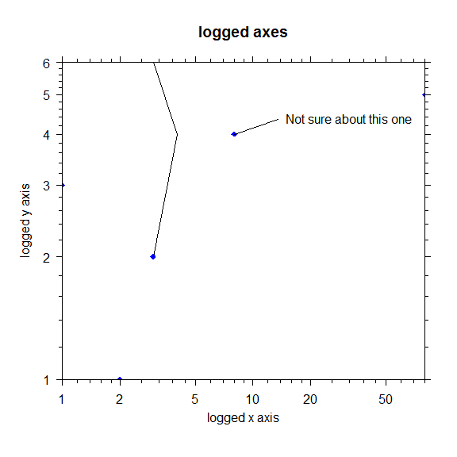

``` r
usrDef <- gsplot(mar=c(4,4,4,4), xaxs='r', yaxs='r') %>% 
     points(x=1, y=2, side=c(3,2), legend.name="Points 1", cex=3, xlab='cat') %>% 
     points(x=3, y=4, side=c(1,4), legend.name="Points 2", pch=5, col="red", ylab=expression(paste("Discharge in ",ft^3/s))) %>% 
     lines(x=c(3,4,3), y=c(2,4,6), legend.name="Lines 1", lty=5, col="orange") %>%
     lines(x=c(1,2,5), y=c(1,8,5), legend.name="Lines 2", lwd=3, ylab='Science!', xlab='dogs') %>%  
     legend(x=1.5,y=4)
usrDef
```

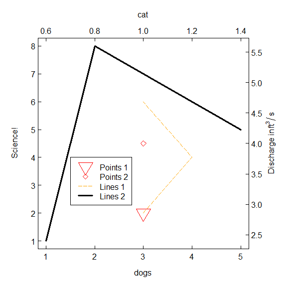

Multiple plots in one figure
----------------------------

What if you wanted to see if there was any relationship between the pH and water temperature? Consider the following three graphs: pH vs water temperature, pH timeseries, water temperature timeseries. To view these three plots at one time, use `layout` to "append" the three different plots.

``` r
MaumeeDV <- MaumeeDV
site <- '04193490'

Maumee_1 <- MaumeeDV[MaumeeDV$site_no == site,]

plot1 <- gsplot() %>% 
  points(Maumee_1$Wtemp, Maumee_1$pH_Median, col="black", pch=20)%>%
  title(main=paste("Site", site), xlab="Water Temperature (deg C)", ylab="pH")
plot2 <- gsplot() %>% 
  lines(Maumee_1$Date, Maumee_1$pH_Median, col="seagreen")%>%
  title(main="", xlab="time", ylab="pH")
plot3 <- gsplot() %>% 
  lines(Maumee_1$Date, Maumee_1$Wtemp, col="orangered")%>%
  title(main="", xlab="time", ylab="Water Temperature (deg C)")

layout(matrix(c(1,2,3), byrow=TRUE, nrow=3))
plot1
```

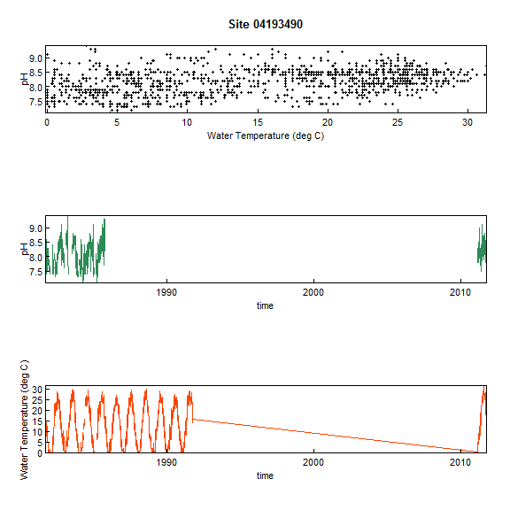

``` r
plot2
```


``` r
plot3
```


Disclaimer
----------

This software is in the public domain because it contains materials that originally came from the U.S. Geological Survey, an agency of the United States Department of Interior. For more information, see the [official USGS copyright policy](http://www.usgs.gov/visual-id/credit_usgs.html#copyright/ "official USGS copyright policy")

Although this software program has been used by the U.S. Geological Survey (USGS), no warranty, expressed or implied, is made by the USGS or the U.S. Government as to the accuracy and functioning of the program and related program material nor shall the fact of distribution constitute any such warranty, and no responsibility is assumed by the USGS in connection therewith.

This software is provided "AS IS."

[](http://creativecommons.org/publicdomain/zero/1.0/)
