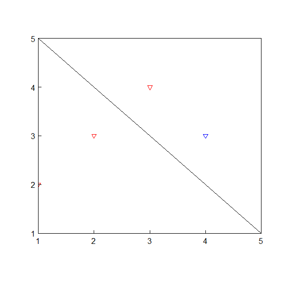

Installation
------------

Currently only available via github. Easiest way to install is to use the `devtools` package:

``` r
devtools::install_github("USGS-R/gsplot")
```

This package is still very much in development, so the API may change at any time.

[](https://ci.appveyor.com/project/jread-usgs/gsplot)

[](https://travis-ci.org/USGS-R/gsplot)

[](https://coveralls.io/github/USGS-R/gsplot?branch=master)

Overview
--------

The goal of this package is to simplify plotting in R. This includes improving the basic workflow and using defaults that tend to adhear to USGS style guidelines.

Improved workflow examples
--------------------------

``` r
library(gsplot)

demoPlot <- gsplot() %>%
  points(y=c(3,1,2), x=1:3, xlim=c(0,NA),ylim=c(0,NA),
         col="blue", pch=18, legend.name="Points", xlab="Index") %>%
  lines(c(3,4,3), c(2,4,6), legend.name="Lines", ylab="Data") %>%
  abline(b=1, a=0, legend.name="1:1") %>%
  axis(side=c(3,4), labels=FALSE) %>%
  legend(location="topleft",title="Awesome!") %>%
  grid() %>%
  error_bar(x=1:3, y=c(3,1,2), y.high=c(0.5,0.25,1), y.low=0.1) %>%
  error_bar(x=1:3, y=c(3,1,2), x.low=.2, x.high=.2, col="red",lwd=3) %>%
  callouts(x=1, y=2.8, lwd=2, angle=250, labels="Weird data") %>%
  title("Graphing Fun")
demoPlot
```


``` r
library(gsplot)

gs <- gsplot() %>%
  points(y=c(3,1,2,4,5), x=c(1:3,8,80), col="blue", pch=18, legend.name="Points") %>%
  lines(c(3,4,3), c(2,4,6), legend.name="Lines", ylab="logged y axis", xlab="logged x axis", log='xy') %>%
  callouts(x=8, y=4, lwd=2, angle=45, labels="Not sure about this one") %>%
  title("logged axes") %>%
  axis(side=c(1,2,3,4), labels=FALSE, n.minor=4) %>%
  axis(side=c(1,2))
gs
```



``` r
library(gsplot)
usrDef <- gsplot(mar=c(4,4,4,4), xaxs='r', yaxs='r') %>% 
     points(x=1, y=2, side=c(3,2), legend.name="Points 1", cex=3, xlab='cat') %>% 
     points(x=3, y=4, side=c(1,4), legend.name="Points 2", pch=5, col="red", ylab=expression(paste("Discharge in ",ft^3/s))) %>% 
     lines(x=c(3,4,3), y=c(2,4,6), legend.name="Lines 1", lty=5, col="orange") %>%
     lines(x=c(1,2,5), y=c(1,8,5), legend.name="Lines 2", lwd=3, ylab='Science!', xlab='dogs') %>%  
     legend(x=1.5,y=4)
usrDef
```


Disclaimer
----------

This software is in the public domain because it contains materials that originally came from the U.S. Geological Survey, an agency of the United States Department of Interior. For more information, see the [official USGS copyright policy](http://www.usgs.gov/visual-id/credit_usgs.html#copyright/ "official USGS copyright policy")

Although this software program has been used by the U.S. Geological Survey (USGS), no warranty, expressed or implied, is made by the USGS or the U.S. Government as to the accuracy and functioning of the program and related program material nor shall the fact of distribution constitute any such warranty, and no responsibility is assumed by the USGS in connection therewith.

This software is provided "AS IS."

[](http://creativecommons.org/publicdomain/zero/1.0/)
